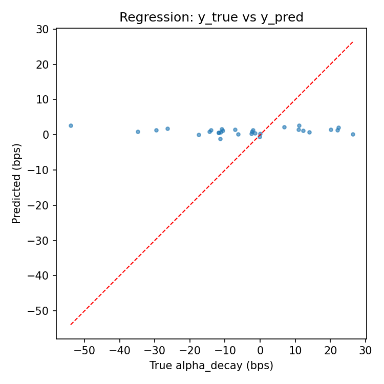
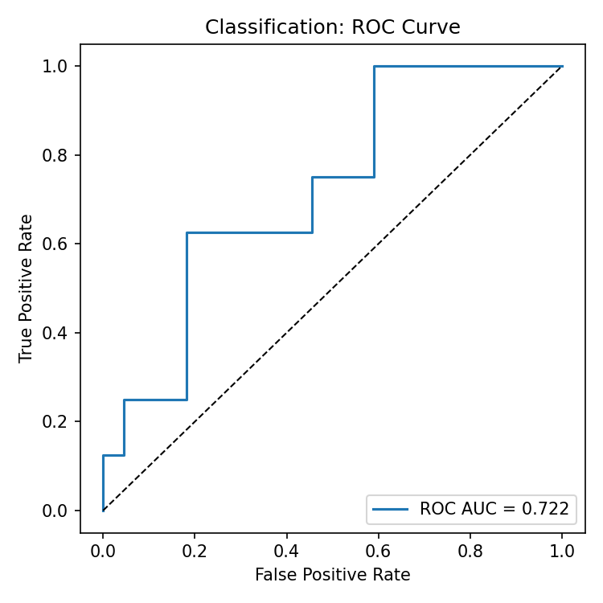

# Alpha Decay Demo (Python)

## Executive Summary

- Predicts how much alpha will erode between a signal and your execution, and explains why (latency, spread/vol, footprint).
- One command to run locally; outputs plots and per-order “cards”.

Plots (from a sample run):




Example explanation cards (first 3):

```json
[
  {
    "parent_id": "4a54abcf74d8cdfdb2f2b2dc8bfbf77070dbf32e",
    "prediction_bps": 2.22,
    "risk_bucket": "HIGH",
    "top_drivers": [
      { "feature": "lit_volume_est", "importance": -0.0026, "sign": "-" },
      { "feature": "minute_of_day", "importance": -0.0026, "sign": "-" },
      { "feature": "signal_strength_rank", "importance": 0.0024, "sign": "+" }
    ],
    "suggested_tactics": [
      "Balanced POV ~10–15%, mix LIT/DARK, throttle marketable flow"
    ],
    "guardrails": ["Do not exceed participation_cap"]
  },
  {
    "parent_id": "de3b90a53d0a3f0b09d77646130198fe3bc48e65",
    "prediction_bps": 1.16,
    "risk_bucket": "MED",
    "top_drivers": [
      { "feature": "lit_volume_est", "importance": -0.0026, "sign": "-" },
      { "feature": "minute_of_day", "importance": -0.0026, "sign": "-" },
      { "feature": "signal_strength_rank", "importance": 0.0024, "sign": "+" }
    ],
    "suggested_tactics": [
      "Balanced POV ~10–15%, mix LIT/DARK, throttle marketable flow"
    ],
    "guardrails": ["Do not exceed participation_cap"]
  },
  {
    "parent_id": "cd3276db829676208bad57f530b42fcaac3121ae",
    "prediction_bps": 1.34,
    "risk_bucket": "MED",
    "top_drivers": [
      { "feature": "lit_volume_est", "importance": -0.0026, "sign": "-" },
      { "feature": "minute_of_day", "importance": -0.0026, "sign": "-" },
      { "feature": "signal_strength_rank", "importance": 0.0024, "sign": "+" }
    ],
    "suggested_tactics": [
      "Balanced POV ~10–15%, mix LIT/DARK, throttle marketable flow"
    ],
    "guardrails": ["Do not exceed participation_cap"]
  }
]
```

A minimal, modular Python demo that simulates market and execution data, builds a SQLite database, computes labels and features, trains a scikit-learn model, and analyzes alpha decay with simple explanations.

## Overview

- Simulated datasets for 5–10 equities, 5 trading days, and ~10–20k child fills
- Storage in CSVs (`data/`) and a SQLite DB (`db/`)
- Deterministic runs via fixed random seeds
- Modular scripts in `src/` and a single entrypoint to run end-to-end

## Setup

```bash
python -m venv .venv && source .venv/bin/activate
pip install -r requirements.txt
```

## Run end-to-end

```bash
python -m src.run_demo
```

## Outputs

- SQLite DB at `db/alpha.sqlite`
- Plots at `data/*.png`
- Explanation cards at `data/explanations.jsonl`
- Metrics printed to console

## Notes

- Only standard scientific Python stack is used: pandas, numpy, scikit-learn, matplotlib, SQLite
- No external services or web apps are required
- The “LLM explanation” is rule-based in this demo to avoid external dependencies, but is API-pluggable.
- This repository is for demonstration purposes only; data are simulated
