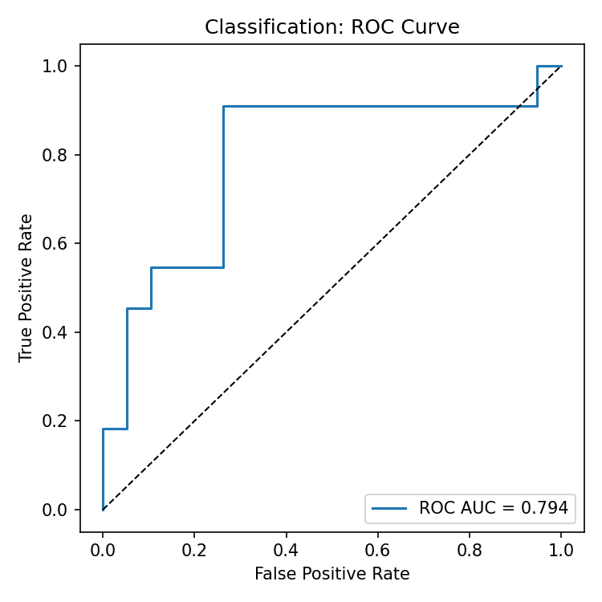

# Alpha Decay Demo

Institutional execution framed as signal preservation. This sandbox simulates signals, parent/child execution, and market microstructure to measure alpha decay, predict it with lightweight ML, and explain drivers in trader-ready language.

---

## Executive summary

- **What it is**: A fast, reproducible demo that models and explains parent-order alpha decay from arrival-time microstructure and order parameters.
- **What it does today**:
  - Simulates signals, orders, child fills, and minute bars (synthetic but realistic).
  - Computes parent-level alpha-decay labels and builds arrival-only features.
  - Trains regression and classification baselines; saves plots and metrics.
  - Emits concise per-parent “explanation cards” with predicted decay, drivers, and suggested tactics.
- **Who it’s for**: Execution researchers, quants, and traders who want to move beyond pure cost minimization toward preserving predicted alpha.
- **Why it matters**: Execution decisions (urgency, participation, venue mix) can either protect or destroy alpha. Measuring, predicting, and explaining decay is the foundation for adaptive, alpha-aware execution.

---

## Introduction: Alpha decay and signal preservation

In systematic trading, a signal’s predictive edge decays quickly. Execution must be understood as preserving that edge, not only minimizing cost.

\[
\text{Realized Alpha} = \text{Predicted Alpha} - (\text{slippage} + \text{market impact} + \text{signal decay})
\]

This demo operationalizes that idea end-to-end.

---

## What this project does (today)

- **End-to-end workflow**: signal → parent order → child fills → market context → labels → features → models → explanations
- **Labels**: parent-level `alpha_decay` in bps and a `decay_flag` based on adaptive thresholds
- **Features**: arrival microstructure (spread, imbalance, RV), time-of-day, signal context, planned policy knobs (e.g., participation cap), regime flags
- **Models**: monotone-constrained regression (HGBR) and logistic classification with tuned thresholds
- **Outputs**: scatter/ROC plots, `data/explanations.jsonl` with risk buckets, drivers, suggested tactics, and simple guardrails

Data are synthetic and sized to run in seconds; all artifacts are written to `data/` and `db/`.

---

## Roadmap: AI interpretation and market context (goals)

Integrate AI to interpret every significant output and contextualize risk with current market conditions:

- **Per-parent narratives**: LLM augments cards with concise, trader-friendly explanations citing metrics and uncertainty.
- **Per-asset and day summaries**: roll-up of drivers, regime performance, and what-if scenarios.
- **Market context**: optional feeds (index returns, vol, economic/earnings calendars) to flag relevant shifts that inform execution urgency.
- **Shareable report**: generate a daily HTML/Markdown brief combining diagnostics, context, and cards.

All AI features are opt-in and degrade gracefully to rule-based text when disabled.

## What is this?

A lightweight research proof of concept that demonstrates how alpha-aware execution can be measured, modeled, and explained.

- **Problem traders face**: signals decay quickly after order arrival, driving slippage and timing risk.
- **What this demo does**: simulates orders + fills, computes decay labels, trains models, and produces transparent “explanation cards” that reveal what drove outcomes.
- **Why it matters**: it frames execution as a signal preservation problem.

⚠️ Data is simulated and synthetic

---

## Questions it helps answer

- How quickly do signals decay post-execution?
- Which microstructure features best predict decay?
- How should urgency or participation caps change when decay risk is high?
- Can pre-trade analytics / TCA include decay metrics alongside slippage and cost?

---

## In this Demo:

- **End-to-end workflow**:
  signal → parent order → child fills → market context → labels → features → models → explanations
- **Database**: all orders, fills, and market bars joined in one SQLite file
- **Models**: monotone-constrained regression predicting `alpha_decay` (bps) and a logistic classifier flagging high-decay risk
- **Visuals**: regression scatter, ROC curve
- **Explanation Cards**: concise summaries of predicted risk and drivers

---

## Quick start

```bash
# 1) Clone repo
# 2) Create a virtual environment and install deps
python3 -m venv .venv && source .venv/bin/activate
pip install -r requirements.txt

# 3) Run the full pipeline (simulate → DB → labels → features → train → explain)
python3 -m src.run_demo
```

Outputs are written to `data/` and `db/`.

---

## Optional: LLM summaries for cards

You can add short LLM-generated blurbs to each card (otherwise the project uses simple rule-based text):

```bash
pip install openai
export OPENAI_API_KEY=sk-...
export OPENAI_MODEL=gpt-4o-mini   # optional
export LLM_ENABLE=1               # enable LLM summaries
python -m src.run_demo
```

---

## What you’ll see (example)

**Console:**

```
Regression MAE (bps) on test: 14.6
Classification ROC-AUC on test: 0.74
Precision/Recall @ tuned threshold: 0.41 / 0.53
Top permutation importances: spread_bp, imbalance, urgency_tag
```



The classification task (“high decay” vs “not”) shows useful discrimination (AUC \~0.72), even on a small test set. The stepped shape reflects the small sample size, but it suggests features like **spread**, **imbalance**, and **urgency** carry information about decay risk.

**Explanation card (one line of `data/explanations.jsonl`):**

Each card summarizes the prediction + drivers for a parent order:

```json
{
  "parent_id": "ORD123",
  "prediction_bps": -5.7,
  "interval_bps": { "q10": -9.2, "q50": -5.6, "q90": -2.1 },
  "risk_bucket": "HIGH",
  "top_drivers": [
    { "feature": "spread_bp", "importance": 0.0123, "sign": "+" },
    { "feature": "urgency_HIGH", "importance": 0.0098, "sign": "+" },
    { "feature": "imbalance", "importance": 0.0061, "sign": "-" }
  ],
  "suggested_tactics": [
    "Increase POV to ~18–25%, bias DARK ~60%, allow marketable in small clips"
  ],
  "guardrails": [
    "Do not exceed participation_cap (20%)",
    "High uncertainty: prefer robust tactics; avoid overfitting to point estimate"
  ]
}
```

Each card is a plain summary for a parent order: predicted decay (bps), a risk bucket, the top drivers, and suggested tactics/guardrails. Even if the regression is noisy, the cards remain useful for decision support.

---

## Run parts of the pipeline

```bash
# 1) Generate synthetic CSVs
python -m src.simulate_data

# 2) Create SQLite DB and ingest tables
python -m src.ingest

# 3) Compute labels & build features
python -m src.label
python -m src.features

# 4) Train models & produce plots
python -m src.train

# 5) Score test set & emit explanation cards
python -m src.predict_explain
```

---

## Repository structure

```
alpha_decay_demo/
  README.md
  requirements.txt
  src/
    simulate_data.py     # signals, market bars, parent orders, child fills → CSVs
    ingest.py            # build SQLite and load CSVs → db/alpha.sqlite
    label.py             # compute alpha_decay/flags → parquet
    features.py          # arrival-time features and regime flags
    train.py             # train/evaluate; save models/plots/metrics
    predict_explain.py   # score test, generate explanation cards (JSONL)
    what_if.py           # predictive and structural scenario analysis
    run_demo.py          # orchestrator: run the full pipeline
  data/                  # CSVs, parquet outputs, plots, explanations.jsonl
  db/                    # SQLite database
  docs/
    Data_Schema.md       # column definitions for CSVs & SQLite tables
    examples/            # example plots and sample cards
```

---

## Data flow

1. **Simulate** → `data/signals.csv`, `data/orders.csv`, `data/child_fills.csv`, `data/market.csv`
2. **Ingest** → `db/alpha.sqlite` with indices
3. **Label** → `data/labels.parquet` (alpha decay at parent-order level)
4. **Features** → `data/features.parquet` (arrival microstructure + planned policy knobs + regime flags)
5. **Train** → metrics & plots saved to `data/`
6. **Explain** → `data/explanations.jsonl` (one card per parent order)
7. **What-if (optional)** → `data/what_if.csv` with predictive/structural scenario deltas

---

## Modeling & evaluation

- **Split**: time-aware (last signal date = test; earlier dates = train)
- **Regression**: HistGradientBoostingRegressor with monotonic constraints on key drivers predicts `alpha_decay` (bps).
- **Classification**: LogisticRegressionCV (balanced) with two tuned thresholds (Max-F1 and base-rate).
- **Diagnostics**: permutation importance (reg), rolling-origin eval by day, naive baseline (k·side_sign), optional prediction intervals.
- **Outputs**: scatter + ROC plots, console metrics, and saved artifacts (`model_*.pkl`, `feature_cols.json`, optional `reg_intervals.parquet`).

---

## Quick glossary

- **Alpha**: expected edge (excess return) from a signal over a short horizon.
- **Alpha decay**: how fast that edge fades after the signal and as you trade.
- **bps**: basis points (1 bps = 0.01%).
- **Label**: the value a model tries to predict (e.g., alpha_decay).
- **Feature**: an input variable (e.g., spread, imbalance, urgency).
- **ROC-AUC**: 1.0 is perfect, 0.5 is random; measures classification discrimination.
- **Precision/Recall**: how accurate positive flags are, and how many true positives you find.
- **SNR (signal-to-noise ratio)**: how much useful variation exists vs. noise.

---

## Troubleshooting

- **SQLite ingest errors** → re-run `python -m src.simulate_data` to regenerate CSVs.
- **`merge_asof` sorting** → handled per-asset in `features.py`; ensure input CSVs are fresh.
- **Classification shows 0/0 Precision/Recall** → use the tuned threshold printed to console (don’t default to 0.5).
- **Flat predictions / empty plots** → regenerate data and check feature importance + prediction std.

---

## Notes & limitations

- Data are synthetic and intentionally small; absolute metric levels are illustrative.
- Features are constructed from arrival-time context to avoid leakage; “post-trade” diagnostics are kept separate.
- Regime flags and thresholds are simple by design; adapt to your production standards before live use.

---

## Improvements in progress

- More realistic mock data and mean-reversion signal variants
- Ensemble models and per-regime calibration
- Expanded what-if scenarios and structural re-simulation
- AI interpretation: per-parent narratives, per-asset/day summaries, market context, and a shareable daily report
