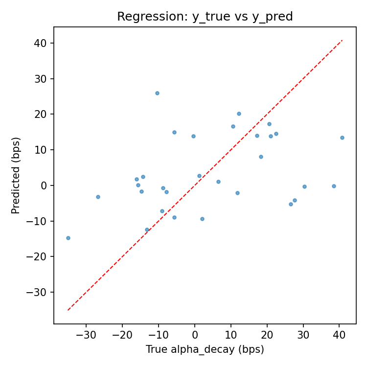

# Alpha Decay Demo

*A minimal, reproducible sandbox to study **alpha decay** around order execution — simulate signals/orders/fills, build labels & features, train baseline models, and generate human-readable explanation cards — end-to-end in less than a minute on a laptop.*

---

## Why this matters

Most trading signals predictive power **decays** once orders hit the market. Classic execution frames the problem as **cost minimization** (reduce slippage vs. a benchmark). Short-horizon systematic strategies also frame execution as **signal preservation** capturing as much predicted alpha as possible **before it decays**.

This demo provides a compact, fully reproducible workflow to **measure decay**, **model it**, and **explain drivers** so traders can reason about trade-offs between **cost** and **timing**.

> **Synthetic data. This is not a production execution system.

---

## Quick start

```bash
# 1) Create a virtual environment and install deps
python -m venv .venv && source .venv/bin/activate
pip install -r requirements.txt

# 2) Run the full pipeline (simulate → DB → labels → features → train → explain)
python -m src.run_demo
```

**Outputs land** in `data/` and `db/`.
Optional: open `notebooks/demo.ipynb` to explore interactively.

---

## What you’ll see (sample)

**Console:**

```
Regression MAE (bps) on test: 14.6
Classification ROC-AUC on test: 0.74
Precision/Recall @ tuned threshold: 0.41 / 0.53
Top permutation importances: spread_bp, imbalance, urgency_tag
```

 

The regression model struggles to predict the exact magnitude of alpha decay. Most predictions collapse near zero, while the true values span –50 to +25 bps. This is typical when the signal-to-noise ratio (SNR) is low or when strong regularization pushes coefficients toward zero. It shows why continuous alpha-decay prediction is difficult with a small synthetic dataset.


The classification task (“high-decay” vs “not”) captures more usable signal. An ROC AUC of ~0.72 indicates the model can discriminate risk better than chance, even on a small test set. The stepped curve reflects the small sample size, but the result suggests features like spread, imbalance, and urgency contain information about decay risk.

**Explanation card (one line of `data/explanations.jsonl`):**

```json
{"parent_id":"ORD123","prediction_bps":-5.7,"risk_bucket":"High decay","top_drivers":["spread_bp","urgency_tag","imbalance"],"suggested_tactics":"Slice smaller, avoid top-of-book","guardrails":"<=10% ADV"}
```
Each card translates a model prediction into summary. It shows the expected decay (bps), a risk bucket, the main drivers, and tactical suggestions (e.g., slicing or participation caps). Even if the regression is weak, these cards are valuable for decision support: they highlight why the model sees risk and how a trader might respond.

---

## Run parts of the pipeline

```bash
# 1) Generate synthetic CSVs
python -m src.simulate_data

# 2) Create SQLite DB and ingest tables
python -m src.ingest

# 3) Compute labels & build features
python -m src.label
python -m src.features

# 4) Train models & produce plots
python -m src.train

# 5) Score test set & emit explanation cards
python -m src.predict_explain
```

---

## Repository structure

```
alpha_decay_demo/
  README.md
  requirements.txt
  src/
    simulate_data.py     # signals, market bars, parent orders, child fills → CSVs
    ingest.py            # create SQLite, tables, bulk insert → db/alpha.sqlite
    label.py             # compute alpha at signal vs. exec; alpha_decay labels → parquet
    features.py          # parent-level features from microstructure & order footprint
    train.py             # ElasticNetCV & LogisticRegressionCV; plots & metrics
    predict_explain.py   # score + generate explanation cards (JSONL)
    run_demo.py          # orchestrator: one command runs everything
  data/                  # CSVs, parquet outputs, plots, explanations.jsonl
  db/                    # SQLite database
  notebooks/
    demo.ipynb           # optional interactive exploration
  docs/
    Guide.md             # detailed guide
    Data_Schema.md       # full column definitions for CSVs & SQLite tables
```

---

## Data flow

1. **Simulate** → `data/signals.csv`, `data/orders.csv`, `data/child_fills.csv`, `data/market.csv`
2. **Ingest** → `db/alpha.sqlite` with indices
3. **Label** → `data/labels.parquet` (alpha decay at parent-order level)
4. **Features** → `data/features.parquet` (microstructure + order footprint)
5. **Train** → metrics & plots saved to `data/`
6. **Explain** → `data/explanations.jsonl` (one card per parent order)

---

## Key schemas (high level)

*See `docs/Data_Schema.md` for full definitions.*

* **signals**: `ts_signal, asset, side, signal_score, alpha_horizon_min, signal_strength_rank`
* **orders**: `parent_id, ts_arrival, asset, side, qty, urgency_tag, algo_type, participation_cap, broker, venue_hint`
* **child\_fills**: `parent_id, ts, price, qty, venue, order_type`
* **market**: `ts, asset, mid, bid, ask, spread_bp, depth1_bid, depth1_ask, imbalance, rv_5m, rv_30m, adv, turnover`

---

## Modeling & evaluation

* **Split**: time-aware — last `ts_signal` date is test; earlier dates are train
* **Regression**: ElasticNetCV (scaled) → predict `alpha_decay` (bps)
* **Classification**: LogisticRegressionCV (balanced), threshold tuned by Max-F1 (with base-rate sanity)
* **Artifacts**: regression scatter, ROC curve, console metrics (MAE, AUC, P/R), permutation importances

---

## Explanation cards

Each card summarizes the prediction + drivers for a parent order:

```json
{
  "parent_id": "ORD123",
  "prediction_bps": -5.7,
  "risk_bucket": "High decay",
  "top_drivers": ["spread_bp", "urgency_tag", "imbalance"],
  "suggested_tactics": "Slice smaller, avoid top-of-book",
  "guardrails": "<=10% ADV"
}
```

Use these to translate model outputs into **tactics** (e.g., slicing, urgency) and **guardrails** (participation caps, venue filters).

---

## Research framing: cost vs. preservation

* **Cost minimization (classic)**: reduce implementation shortfall / slippage vs. benchmarks (arrival, VWAP).
* **Signal preservation (alpha-aware)**: when signals are short-lived, prioritize **capturing predicted alpha before it decays**, even if that means accepting higher impact.

This project shows how to **quantify and model** decay so execution decisions can trade off **cost** vs. **timing** with eyes open.

---

## Reproducibility

* Fixed seeds where relevant
* Small dataset (e.g., 5 assets × 5 days) → fast runs
* Pure-Python stack: pandas, numpy, scikit-learn, matplotlib, sqlite-utils, pyarrow, joblib
* Deterministic outputs under `data/` and `db/`

---

## Optional: LLM summaries for cards

If you want short LLM-generated blurbs appended to each card (instead of rule-based text):

```bash
pip install openai
export OPENAI_API_KEY=sk-...
export OPENAI_MODEL=gpt-4o-mini   # optional override
export LLM_ENABLE=1               # enable LLM summaries
python -m src.run_demo
```

If unset, cards **fall back to rule-based** summaries.

---

## Questions to explore

* How quickly does signal strength decay post-arrival?
* Which microstructure features (spread, imbalance, volatility) drive decay most?
* How stable are decay patterns across assets / dates?
* How could decay risk be incorporated into **pre-trade** analytics or **TCA**?

---

## Limitations & next steps

**Known issues observed in sample outputs (and fixes)**  

- **Small test set / high variance metrics:** Stepped ROC and noisy scatter indicate few test points.  
  *Fix:* simulate more days/assets, use Cross-Validation (grouped by date/asset), and report CIs/bootstraps for AUC/MAE.

- **Low signal-to-noise ratio for continuous bps target:** Continuous `alpha_decay` may be hard to learn with current features. Most variation in the labels is random/noisy relative to the features. Regression tends to collapse toward the mean, and predictions look flat (like in your scatter).
  *Fix:* add interactions (e.g., `urgency×spread`, `imbalance×rv`), widen `alpha`/`l1_ratio` grid. Log `std(y_pred)` vs `std(y_true)` to catch collapse early.

- **Potential scaling/join pitfalls:** Mis-sorted `merge_asof` or inconsistent scaling can flatten signal.  
  *Fix:* ensure per-asset time-sorted joins; verify scaler fit on train only.

- **Classification calibration:** AUC looks decent, but probabilities may be uncalibrated on small N.  

---

## Troubleshooting

* **SQLite ingest errors** → re-run `python -m src.simulate_data` to regenerate CSVs
* **`merge_asof` sorting errors** → handled per-asset in `features.py`
* **Classification 0/0 P/R** → use the tuned threshold printed (don’t default to 0.5)
* **Flat predictions / empty plots** → check prediction std + permutation importances; ensure fresh simulation data

---
